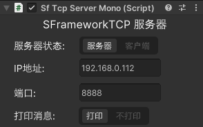
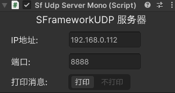
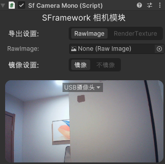
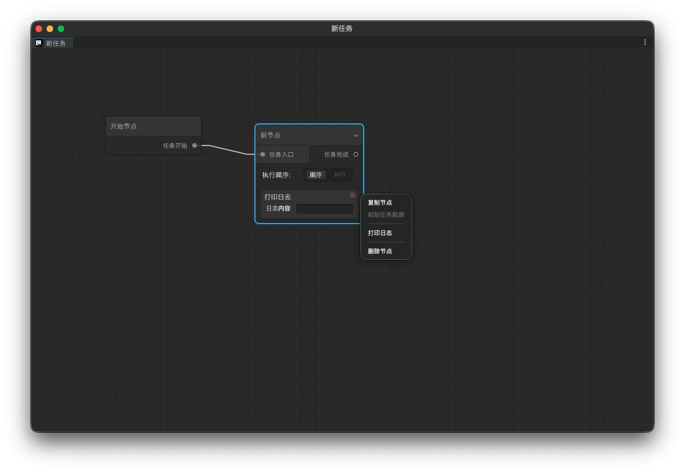

# SFramework
SFramework For Unity

SFNet(负责网络的通讯)

包含TCP,UDP

SFHardware(负责硬件的交互)

包含 相机和麦克风模块,开箱即用的测试功能和调用

SFDB(数据库的连接)

可视化的数据库连接,动态编辑同步数据,同时包含开箱即用的sqlite数据库模块

SfTask(任务流)

开箱即用的任务编辑器,模块化任务配置,可视化任务配置,支持导出至文件,动态外部加载

SFMultiple(多人模块)

包含kcp的局域网多人游戏