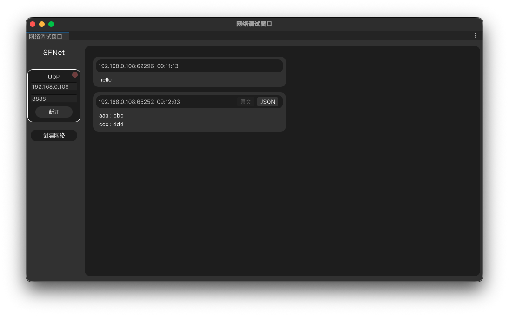
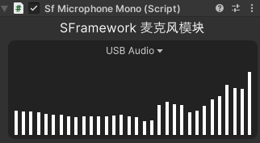
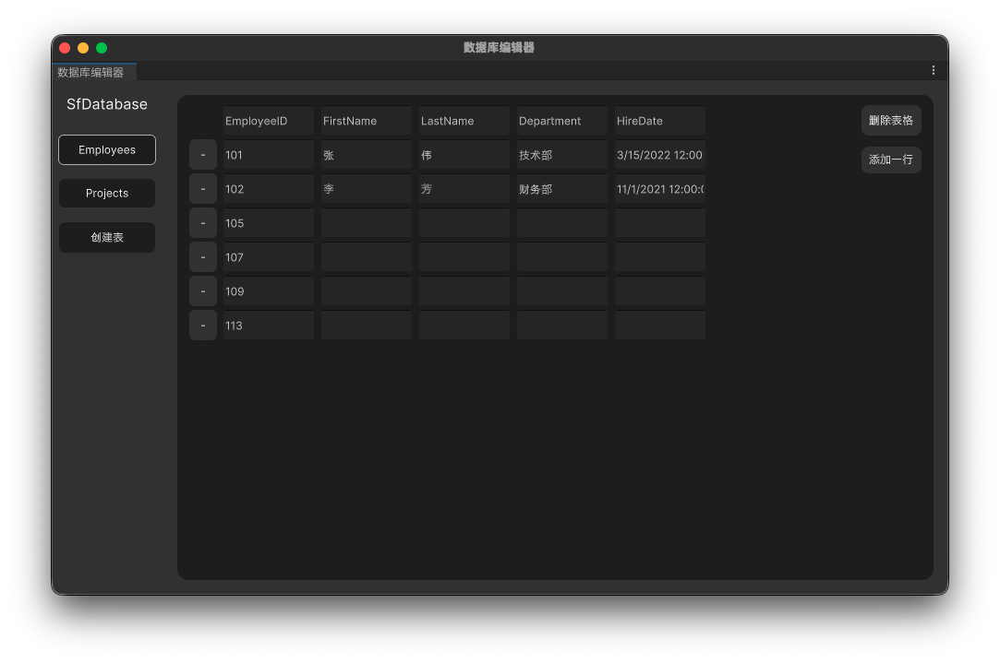

# 🛠️ SFramework For Unity

  
  
  

SFramework 是一个为 Unity 开发者设计的轻量化、模块化开发框架，涵盖了从网络通讯到硬件交互的全方位解决方案。

---

## 📦 核心模块说明

### 🌐 SFNet | 网络通讯
> **功能描述：** 负责底层的网络通讯逻辑，提供高效稳定的数据传输。

| 支持协议 | 可视化预览 |
| :--- | :--- |
| 包含 **TCP** 和 **UDP** 实现。 |  |

---

### 📷 SFIO | IO 模块
> **功能描述：** 综合性的 IO 模块，负责与物理硬件的交互、文件操作和音频处理，提供开箱即用的测试功能和 API 调用。

* **硬件交互**：相机模块支持快速调用摄像头进行画面采集；麦克风模块支持音频输入与测试。
* **文件操作**：支持多平台文件读取（StreamingAssets、文本、JSON、图片、音频等）。
* **串口通讯**：支持串口通信，包含自动主线程分发与协议解析。
* **音频处理**：支持 WAV 文件的加载和保存。

  
  

---

### 🗄️ SFDB | 数据库管理
> **功能描述：** 可视化的数据库连接工具，支持动态编辑与数据同步。

* **特性**：内置开箱即用的 **SQLite** 数据库模块。
* **编辑器**：支持在 Unity Editor 中直接操作数据库内容。

---

### 📝 SFTask | 任务流系统
> **功能描述：** 模块化、可视化的任务编辑器。

* **灵活性**：支持任务配置导出至文件。
* **动态化**：支持外部加载，无需重新编译即可更改逻辑。

---

### 👥 SFMultiple | 多人模块
> **功能描述：** 包含基于 **KCP** 协议的局域网多人游戏解决方案，确保低延迟交互。

 

---

### 🏗️ SFArchitecture | 架构模式
> **功能描述：** 提供完整的 **MVC/MVVM** 架构模式实现，帮助开发者构建清晰、可维护的代码结构。

* **MVC 模式**：提供 Controller、Model、View 基类，实现数据与视图的分离。
* **事件总线**：内置事件总线系统，支持模块间的解耦通信。

---

### 📄 SFOffice | 办公文档处理
> **功能描述：** 提供 Office 文档的读取和处理功能，支持 Excel、Word、PDF 等格式。

* **Excel 支持**：完整的 Excel 文件读写功能，支持数据导入导出。
* **可视化编辑器**：在 Unity Editor 中直接操作 Office 文档。

  
  
  

---

### 🔄 SFState | 状态机系统
> **功能描述：** 提供灵活的状态机实现，支持状态管理和流程控制。

* **状态管理**：基于接口的状态机设计，易于扩展和维护。
* **流程控制**：支持状态切换、更新和退出逻辑的完整生命周期管理。

---

### 🎨 SFUI | UI 模块
> **功能描述：** 提供 Unity UI 相关的组件和工具，帮助开发者快速构建丰富的用户界面。

* **序列帧动画**：支持 Sprite、Image 和 RawImage 渲染的序列帧动画组件。
* **灵活控制**：支持播放范围、循环、帧率设置，支持运行时动态调整。

 

## 🛠️ 模块索引 (Quick Link)

| 模块 | 图标 | 状态 |
| :--- | :---: | :--- |
| **SFArchitecture** |  | ✅ 稳定 |
| **SFDB** |  | ✅ 稳定 |
| **SFIO** |  | ✅ 稳定 |
| **SFMultiple** |  | 🏗️ 迭代中 |
| **SFNet** |  | ✅ 稳定 |
| **SFOffice** |  | ✅ 稳定 |
| **SFState** |  | ✅ 稳定 |
| **SFTask** |  | ✅ 稳定 |
| **SFUI** |  | ✅ 稳定 |