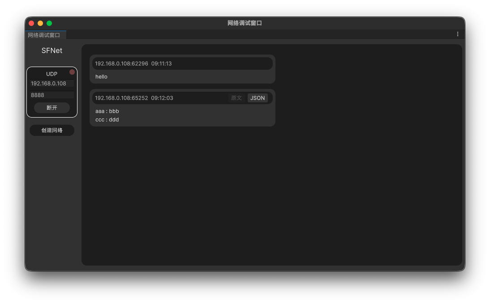
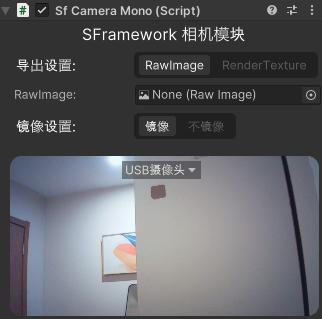
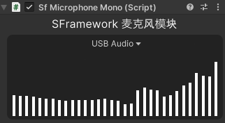
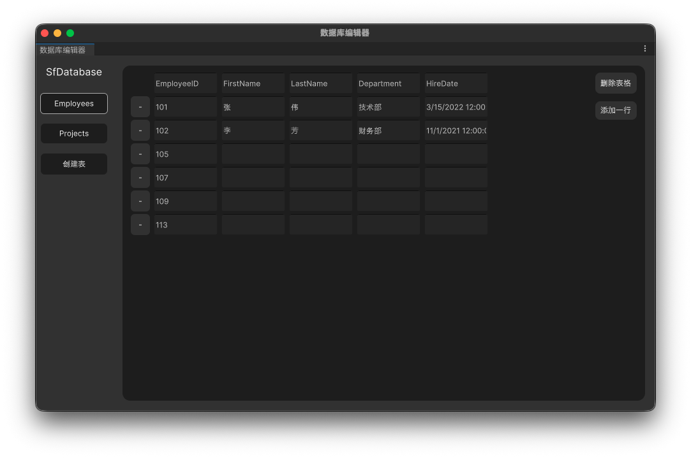
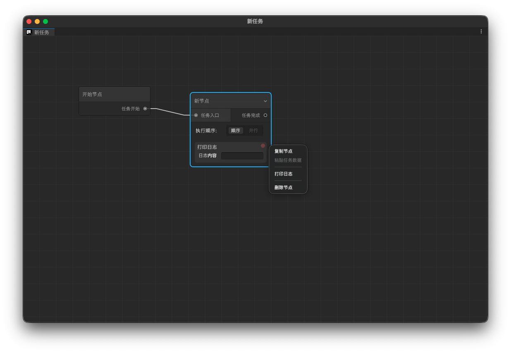

# 🛠️ SFramework For Unity

<p align="left">
  
  
  
</p>

SFramework 是一个为 Unity 开发者设计的轻量化、模块化开发框架，涵盖网络通讯、硬件 IO、AI 三层架构（基座 / 编排 Quick / 运行时接口）、任务流与架构模式等能力。各模块提供 **Mono 单例**（`SfMonoSingleton<T>`），可在 Inspector 中快速配置，运行时通常一行代码即可调用。

---

## 📦 核心模块说明

### 🌐 SFNet | 网络通讯
> **功能描述：** 底层网络通讯，提供稳定的数据传输与可视化调试。

| 能力 | 说明 |
| :--- | :--- |
| **TCP / UDP** | 服务端 / 客户端 Mono 开箱即用 |
| **HTTP** | 内置 HTTP 服务器 |
| **KCP** | 低延迟可靠 UDP（`SfKcpServerMono`） |

| 支持协议 | 可视化预览 |
| :--- | :--- |
| TCP、UDP、HTTP、KCP |  |

---

### 🤖 SAI | 三层架构

```text
AI 基座 (Module)          ← 核心：模型 / 编排 Agent / Tool / MCP
    ├── Quick (Editor/Quick)         ← 产品：对话操作 Unity（编排工作链 UI）
    └── 运行时 AI (Runtime)          ← 只开放接口，项目二次开发
```

设计参考 [DeepSeek Harness (DSH)](https://github.com/deepseek-ai/deepseek-harness)：**Agent Loop + Tool**，阶段间强制 **JSON（`structured_output`）** 交接；非完整移植 DSH Workflow 引擎。

#### ① AI 基座（核心）
> `SAI/Module`：大模型接入、编排 Agent、ToolRegistry、MCP Client。业务无关。

| 能力 | 说明 |
| :--- | :--- |
| **模型** | Kimi / Qwen / DeepSeek / MiMo 等，OpenAI 兼容 + 流式；Agent 路径只用当前选中模型（不自动跨厂兜底） |
| **编排** | `SfAiAgentOrchestrator`：解析任务 → 执行任务 → 检查任务（独立核验 Agent） |
| **单阶段 Loop** | `SfAiAgentRunner` / `SfAiAgentSession`（编排内部复用 Runner） |
| **结构化交接** | 各阶段 `outputSchema` + 强制 `structured_output`；下游只消费上游 JSON |
| **循环检测** | 无固定「最大步数」；连续工具失败 / 重复输出 / JSON 失败时自动打断（另有安全熔断） |
| **Tool** | `ISfAiTool` + `SfAiToolRegistry`（可按阶段过滤只读 / 全量） |
| **MCP** | stdio Client，远程工具桥进 Registry |

**配置工作台：** `SFramework → AI 工作台`

**简单对话 Mono（无工具编排）：**

```csharp
SfAiMono.Instance.Ask("你好", reply => Debug.Log(reply));
```

#### ② Quick（编辑器产品）
> `SAI/Editor/Quick`：基于基座的编排式对话 —— **上方消息 / 工作链，下方输入**。进程内 `unity_*` 操作场景，可挂 MCP。

**菜单：** `SFramework → AI Quick`

| 界面 | 说明 |
| :--- | :--- |
| **消息区** | 用户消息、助手中文结论（不刷屏阶段 JSON） |
| **工作链** | 解析 / 执行 / 核验分段轨迹；操作中图标呼吸，结束后停止 |
| **输入区** | 底部 Composer，Enter 发送 / Shift+Enter 换行；运行中顶部「停止」 |
| **设置** | 运营商 / API Key / 模型 / 系统提示词，与工作台共用 `SfAiSettings`；可选 MCP |

**进程内 Unity 工具（节选）：**

| 工具 | 用途 |
| :--- | :--- |
| `unity_get_hierarchy` | 读 Hierarchy（含组件摘要） |
| `unity_create_gameobject` | 创建物体，可选一次挂组件 |
| `unity_create_ui` | 带组件 UI：canvas / panel / text / button / image 等 |
| `unity_add_component` | 给已有物体挂组件 |
| `unity_set_ui` | 设置文案、颜色、Rect 等 |
| `unity_find_gameobject` / `unity_select_gameobject` | 查找 / 选中 |

> Unity 是组件式：搭 UI 请用 `unity_create_ui` 或 create + `unity_add_component`，不要只建空物体。

#### ③ 运行时 AI（开放接口）
> `SAI/Runtime`：基于基座走同一套编排，**不内置业务工具**。开发者注册项目工具后调用。

```csharp
public class MyGameAi : SfAiRuntimeMono
{
    public override void RegisterTools(SfAiToolRegistry registry)
    {
        registry.Register(new MyQuestTool());
        registry.Register(new MyInventoryTool());
    }
}

// 使用（内部为 解析 → 执行 → 核验）
GetComponent<MyGameAi>().Run("给玩家发新手任务", r => Debug.Log(r.FinalText));
```

| 类型 | 职责 |
| :--- | :--- |
| `ISfAiRuntimeAgent` | Run / Cancel |
| `ISfAiRuntimeToolModule` | 注册项目工具 |
| `SfAiRuntimeHost` | 无 Mono 的 Host 组装（编排器） |
| `SfAiRuntimeMono` | 可挂场景的开放基类 |
| `SfAiRuntimeExample` | 二次开发示例 |

| 结果字段 | 说明 |
| :--- | :--- |
| `FinalText` | 面向用户的中文结论 |
| `PlanText` / `ExecuteText` / `VerifyText` | 各阶段 JSON（程序可读） |
| `Verified` | 核验是否 PASS |

---

### 📷 SFIO | IO 模块
> **功能描述：** 硬件交互、文件操作、串口与音频处理。

* **硬件交互**：相机画面采集；麦克风录音与 VAD。
* **文件操作**：StreamingAssets、文本、JSON、图片、音频等。
* **串口通讯**：自动主线程分发与协议解析。
* **音频处理**：WAV 加载与保存。

<p align="center">
  
  
</p>

---

### 🗄️ SFDB | 数据库管理
> **功能描述：** 可视化 SQLite 工具，支持在 Editor 中直接操作数据。

* **特性**：开箱即用的 **SQLite** 模块（`SfSqliteMono`）。
* **编辑器**：Unity Editor 内表结构与数据编辑。



---

### 📝 SFTask | 任务流系统
> **功能描述：** 模块化、可视化任务编辑器。

* **灵活性**：任务配置可导出为 `.sftask` 文件。
* **动态化**：运行时加载，无需重新编译即可调整逻辑。



---

### 🏗️ SFArchitecture | 架构模式
> **功能描述：** **MVC / MVVM** 与事件总线，便于模块解耦。

* **MVC**：`SfControllerBase`、`SfModelBase`、`SfViewBase`。
* **事件总线**：`SfEventBus` 跨模块通信。

---

### 📄 SFOffice | 办公文档处理
> **功能描述：** Excel、Word、PDF 等文档读写与 Editor 可视化操作。

<p align="center">
  
  
  
</p>

---

### 🔄 SFState | 状态机系统
> **功能描述：** 流程 / 状态机，支持完整生命周期（Enter / Update / Exit）。

* **Mono**：`SfProcessMono` 在 Inspector 选择起始流程类型。

---

### 🎨 SFUI | UI 模块
> **功能描述：** UI 工具与序列帧动画组件。

* **序列帧**：`SfSequence` 支持 Sprite / Image / RawImage，可设范围、循环与帧率。

---

## 🧩 Mono 单例（通用约定）

各业务模块的运行时入口继承 `SfMonoSingleton<T>`（`Core/Mono/SfMonoSingleton.cs`）：

| 约定 | 说明 |
| :--- | :--- |
| **Inspector** | 拖组件或自动创建单例 GameObject，字段可视化配置 |
| **调用** | `XxxMono.Instance.方法(...)`，尽量保持一行完成主流程 |
| **自定义 Inspector** | 使用 `SfTitleEditor` 显示模块标题（如 `SFramework AI 模块`） |

| Mono | 模块 |
| :--- | :--- |
| `SfUdpServerMono` / `SfTcpServerMono` / `SfHttpServerMono` / `SfKcpServerMono` | SFNet |
| `SfAiMono` / `SfAiRuntimeMono` | SAI |
| `SfCameraMono` / `SfMicrophoneMono` / `SfSerialPortMono` | SFIO |
| `SfSqliteMono` | SFDB |
| `SfTaskMono` | SFTask |
| `SfProcessMono` | SFState |

---

## 🛠️ 模块索引 (Quick Link)

| 模块 | 图标 | 状态 |
| :--- | :---: | :--- |
| **SAI**（基座 + 编排 Quick + 运行时接口） | — | ✅ 稳定 |
| **SFArchitecture** |  | ✅ 稳定 |
| **SFDB** |  | ✅ 稳定 |
| **SFIO** |  | ✅ 稳定 |
| **SFNet** |  | ✅ 稳定 |
| **SFOffice** |  | ✅ 稳定 |
| **SFState** |  | ✅ 稳定 |
| **SFTask** |  | ✅ 稳定 |
| **SFUI** |  | ✅ 稳定 |

> **说明：** 原 **SFMultiple** 中的 KCP 能力已并入 **SFNet**（`SFNet/Module/Kcp`）。
